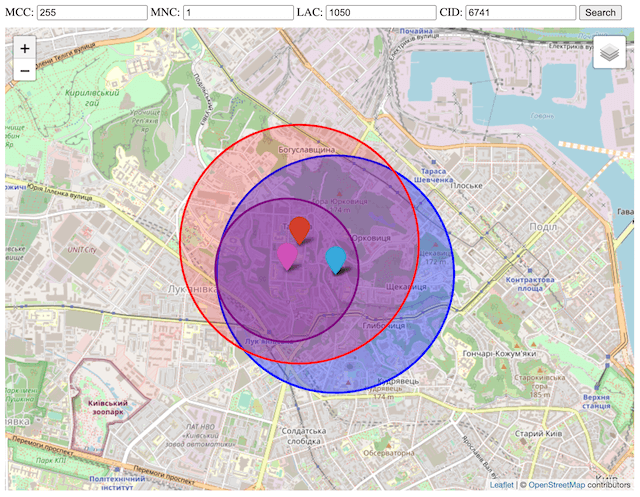

# Geolocation API (cell)

**start server on port 3000**

> npm start

**page with map `index.html`**

**init database**

> mysql -u root -p
>
> mysql> CREATE DATABASE cell;

**allow populating database from file**

> mysql> show global variables like 'local_infile';
>
> mysql> set global local_infile=true;

**requests caching**

> brew install memcached
>
> brew services start memcached
>
> brew services stop memcached

**api providers**

* cell2gps
* mylnikov
* opencellid
* yandex

**databases imported from files**

* clf
* opencellid_csv

**clf files**

* [BY](http://belnetmon.bn.by/generator/generator4v.php)
* [CZ](https://www.gsmweb.cz/celltrack/clf)
* [PL](http://beta.btsearch.pl/bts/export)

